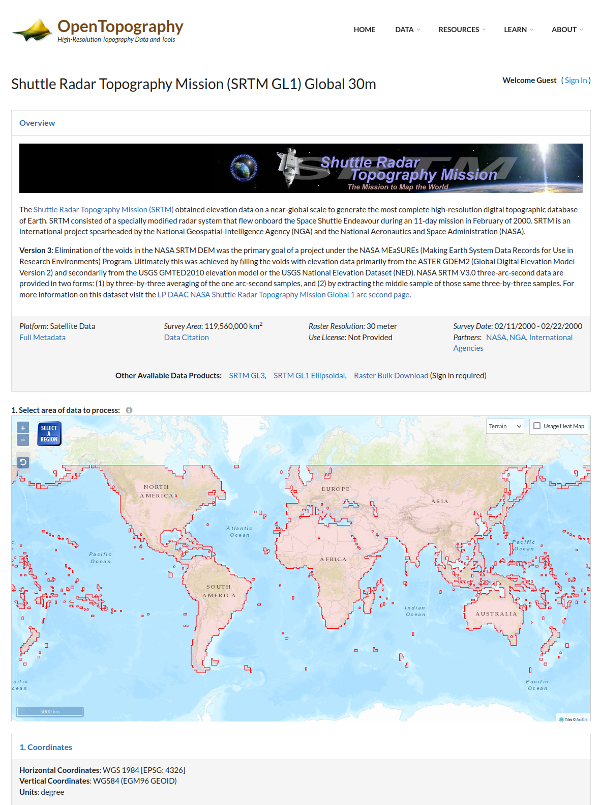
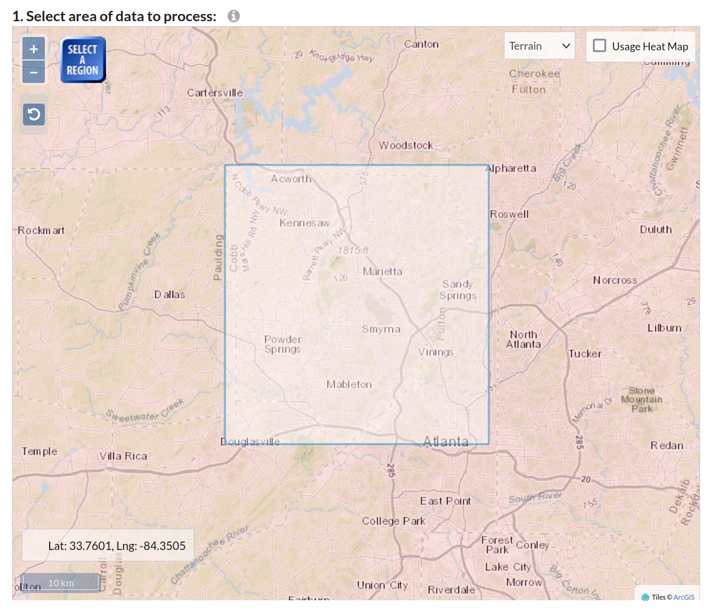
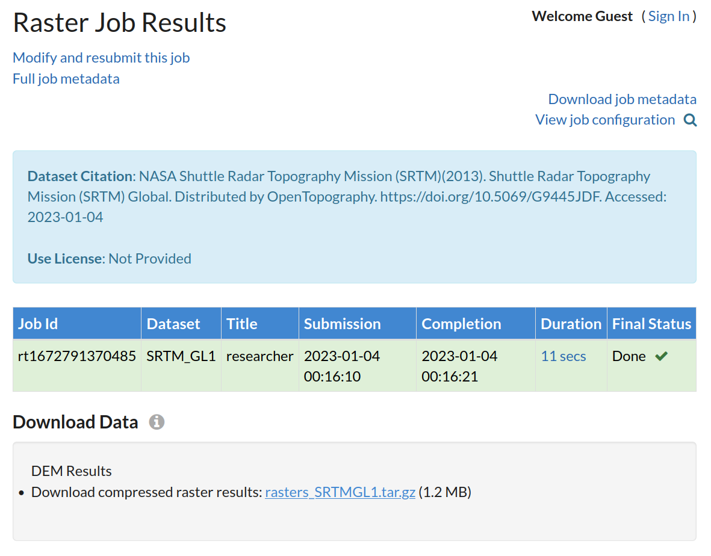
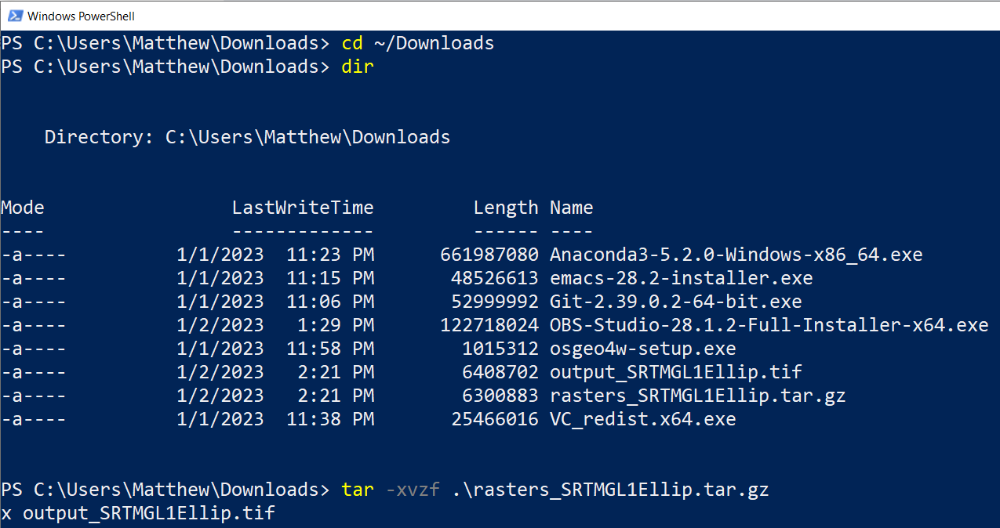
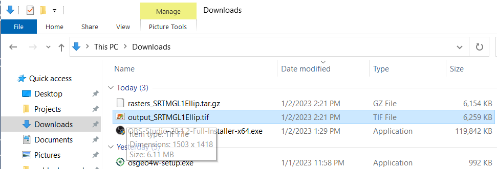
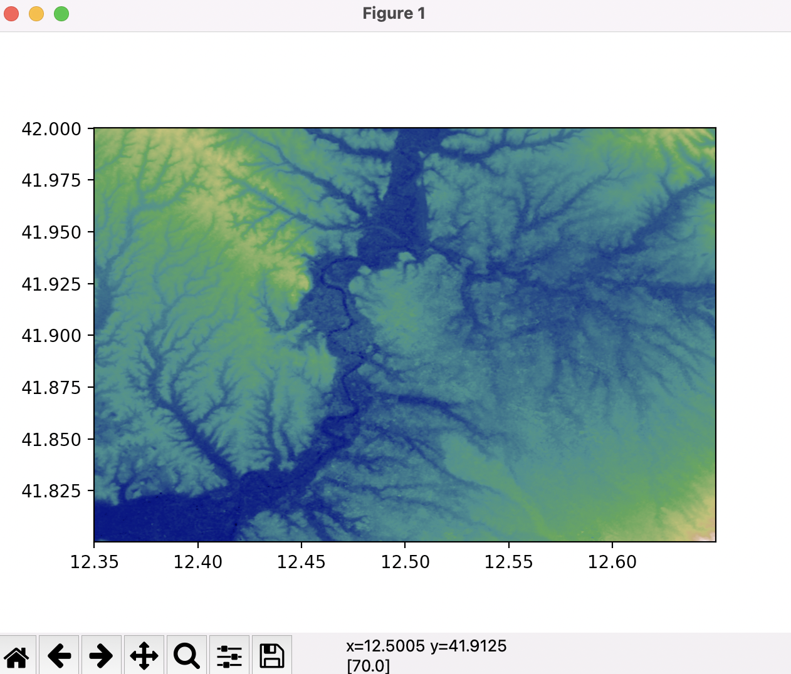

# Fetch a GeoTIFF terrain Digital Elevation Model (DEM) from the internet

Use of OpenAthena requires loading a GeoTIFF Digital Elevation Model (DEM) file, stored as a GeoTIFF `.tif` file.

GeoTIFF files store terrain elevation (height) for an area of the Earth. OpenAthena performs a ray-cast from a drone camera's position and orientation towards terrain (as represented by the DEM). This may be used to precisely locate any selected point within a given picture.

**OpenAthena for iOS only supports GeoTIFF file generated with Method 1**

There are **two methods** supported for obtaining DEM GeoTIFF files. **Method 1** is recommended for users on Windows computers, **Method 2** is recommended for users on Mac or Linux.

# Method 1 (Windows)

The website [OpenTopography.org](https://opentopography.org) (which is not affiliated with OpenAthena) has a free browser-based tool for downloading a customized portion of the SRTM 30m Global terrain elevation dataset.

Open the tool here:

https://portal.opentopography.org/raster?opentopoID=OTSRTM.082015.4326.1

Ensure that you are using the correct dataset. The title of the page should appear just like the image below:
<a href="https://portal.opentopography.org/raster?opentopoID=OTSRTM.082015.4326.1
"></a>

Next, zoom into the area for which you wish to download a Digital Elevation Model for use with OpenAthena.


When you're ready, click the blue square button which reads "SELECT A REGION". Click and drag your mouse cursor until the desired area is covered by a rectangle, as demonstrated in the image below:

<a href="https://portal.opentopography.org/raster?opentopoID=OTSRTM.082015.4326.1
"></a>

Enter in your job title, description, and email address in the appropriate fields. When ready, click the blue rectangular button which reads "Submit", located at the bottom of the page:

<a href="https://portal.opentopography.org/raster?opentopoID=OTSRTM.082015.4326.1
"></a>

This will submit a raster job to the opentopography website's server. You will be taken to a new webpage while your job is pending.

Once your job is completed, a link will become available to download your GeoTIFF DEM file, contained in a compressed `.tar.gz` tarball file:


<a href="https://portal.opentopography.org/raster?opentopoID=OTSRTM.082015.4326.1
"></a>

Click on the link to download the `.tar.gz` tarball file (which contains your desired GeoTIFF DEM).

Once it is downloaded, you must extract your desired DEM from the compressed file. Open up a PowerShell window (a program included with Windows 10). If you are using a system older than Windows 10 or PowerShell is not available to you, you may use the program [7-zip](https://www.7-zip.org/) instead for this step.

By default, you may type in the command:
```
cd ~/Downloads
```

...to make your PowerShell window target your Downloads directory.

Next, type in the command:
```
dir
```

to obtain a list of files in the current directory. Observe that your downloaded tarball file should appear in this list. When ready, type the following but do not yet press the "RETURN" key:
```
tar -xzvf
```

type in a space charachter ` `, then type `rasters` and press the `TAB` key, located on your keyboard above `CAPS LOCK`. PowerShell will automatically complete the rest of the filename for your downloaded tarball file.

If the filename appears correctly, press the "RETURN" key to run the command in PowerShell:



If you have followed these steps correctly, a file ending in `.tif` should appear in your Downloads directory. This is your desired GeoTIFF DEM file, which is compatible with OpenAthena:




Finally, copy this file to your Android or PC device for use with OpenAthena.

# Method 2 (Mac, Linux, Unix)

Method 2 requires the use of [Python3](https://www.python.org/), [gdal](https://gdal.org/), and the [elevation package](http://elevation.bopen.eu/en/stable/quickstart.html#command-line-usage) for Python.

## Install

### Python
[Python3](https://www.python.org/) (and the included pip package manager) must be installed first

Ensure your version of `pip` is up to date:
```bash
python3 -m pip install --upgrade pip
```

_Note: "python3" may just be called "python" depending on the configuration of your system_

### GDAL

Clipping GeoTIFF files requires the `gdal` program, installable with your system's package manager. MacOS does not come with a package manager by default, so users must first install [brew](https://brew.sh/), then run the command:
```
brew install gdal
```
_(if Linux use apt or yum or pacman, etc.)_

...to install this prerequisite program. For Linux or Unix computers, `gdal` is installable with the system's default package manager. A `gdal` and `pygdal` program exist in the pip package manager for Python, however they are incompatible with `elevation` and must not be used.

### Elevation

The Python `elevation` package is capable of downloading and joining tiles from the SRTM 30m dataset. Use of this tool requires installation of `gdal` as a pre-requisite. It is not compatible with Windows computers (except on [WSL2](https://ubuntu.com/tutorials/install-ubuntu-on-wsl2-on-windows-10#1-overview)). `elevation` is installable with `pip`, and can be invoked with the `eio clip` command. It also requires the `gdal` program, available from your system's package manager.


`elevation` can be installed on most systems with the command:
```
python3 -m pip install elevation
```

or alternatively:
```
python -m pip install elevation
```

### Test your installation

To test your installation, run the following command:
```bash
eio selfcheck
```

If your installation is valid and operable, you will see output like the following:
```
Your system is ready.
```

## Command line usage

The `eio clip` command may take a while to complete. This is normal.

You may now identify the geographic bounds of the area of interest and fetch the DEM with the eio command. For example: to clip a GeoTIFF DEM from the SRTM 30m dataset for the city of Rome, Italy (around 41.9N 12.5E) to the filname `Rome-30m-DEM.tif` use:

```
eio clip -o Rome-30m-DEM.tif --bounds 12.35 41.8 12.65 42
```

In the example above, `12.35` is the western longitude bound, `41.8` is the southern latitude bound, `12.65` is the eastern most longitude bound, and `42` is the northernmost latitude bound of the rectangular area of the desired GeoTIFF file.

Note that the `--bounds` option accepts latitude and longitude coordinates (more precisely in geodetic coordinates in the WGS84 refernce system EPSG:4326 for those who care) given as **`left bottom right top`** similarly to the `rio` command form `rasterio`.


<a href="https://github.com/mkrupczak3/OpenAthena#parsegeotiffpy"></a>


To clean up stale temporary files and fix the cache in the event of a connection error use:

```
eio clean
```

For more information, read the Python elevation package's documentation [available here](http://elevation.bopen.eu/en/stable/quickstart.html#command-line-usage).

# Supplementary notes:
The downloaded elevation data is stored in the [GeoTIFF](https://en.wikipedia.org/wiki/GeoTIFF) file format, which performs efficient, lossless compression. Large areas can be downloaded for later use by OpenAthena offline, all while requiring very little disk space.


The excellent elevation data set is generated by a technique known as [Synthetic Aperature Radar](https://www.economist.com/technology-quarterly/2022/01/27/synthetic-aperture-radar-is-making-the-earths-surface-watchable-24/7), which is becoming exceedingly effective and common as a military and GEOint data gathering tool. One advantage of this technique is that radar wavelengths are long enough to pass through some cloud cover before bouncing off of hard surfaces such as metal, buildings, and terrain.

The dataset for the elevation API backing both opentopography.org and the `eio clip` was generated by the (Space) [Shuttle Radar Topography Mission](https://en.wikipedia.org/wiki/Shuttle_Radar_Topography_Mission#Highest_Resolution_Global_Release) conducted in the year 2000. In 2015 a high resolution global [digital elevation model](https://en.wikipedia.org/wiki/Digital_elevation_model), derived from the SRTM dataset, covering most of the world was released to the public without restriction. This DEM derived from the SRTM mission has a high resolution of 1-arc second (approx 30 meters) between each datapoint. [Studies](https://www.sciencedirect.com/science/article/pii/S2090447917300084) have shown the vertical accuracy of the datapoints are very good, with error being observed to be within +/- 10 meters, despite the +/- 16 meters figure which was published in the SRTM data specification.


# Improvement
OpenAthena can accept DEM GeoTIFF files of higher resolution or accuracy than the SRTM dataset, if provided by the user. GeoTIFF files must be of similar format to that of the SRTM dataset to avoid undefined program behavior (Currently, OpenAthena is not capable of translating alternative coordinate systems to WGS84).

One challenge of the SRTM dataset (including improved derivations such as [NASADEM](https://portal.opentopography.org/raster?opentopoID=OTSDEM.032021.4326.2), of which OpenAthena is compatible) is that it tends to include the height of trees and buildings above bare terrain. LIDAR datasets, where available, measuring bare earth terrain elevation will produce superior results. In Europe, the EU_DTM is available which models bare earth terrain elevation reconstructed using Machine Learning techniques, but it is not currently compatible with OpenAthena. A non-free dataset [FABDEM](https://www.fathom.global/product/fabdem/) "A 30 m global map of elevation with forests and buildings removed" is available globaly for paid use.
