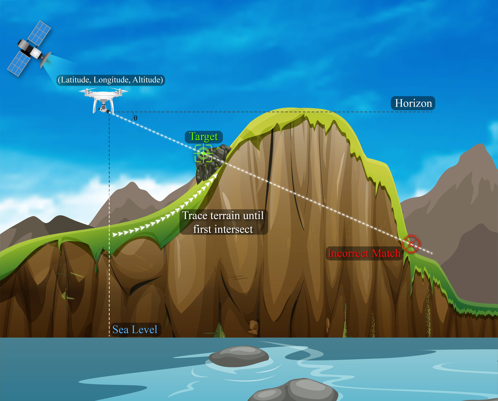
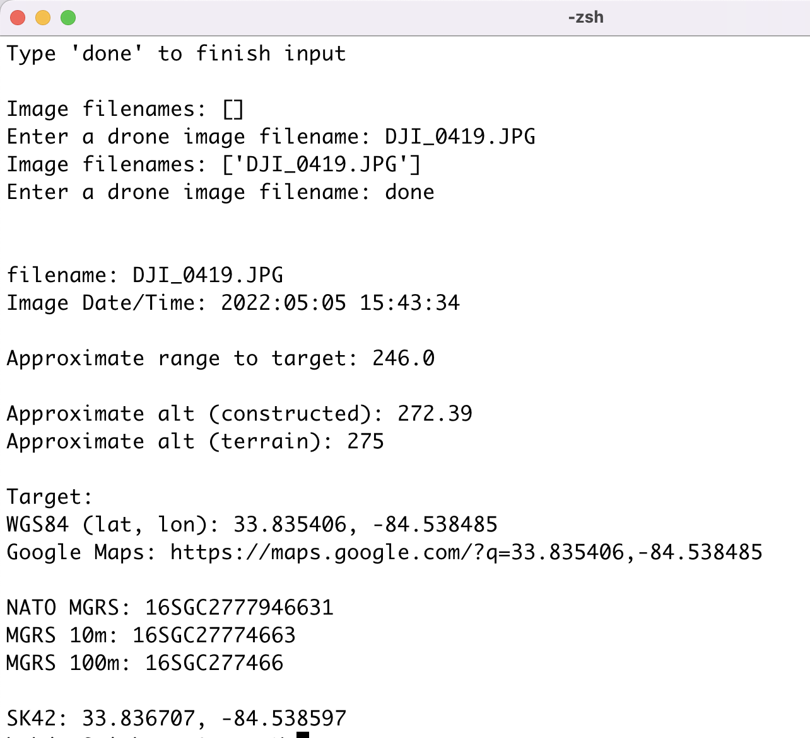
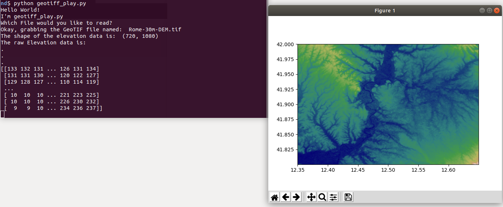

# Open Athena


OpenAthena™ is a project which allows consumer and professional drones to spot precise locations through their images. This is accomplished by combining their [sensor metadata](./drone_sensor_data_blurb.md) with [an offline-ready Digital Elevation Model](./EIO_fetch_geotiff_example.md) to provide the instant location of what is being observed

🖼️👨‍💻 + 🧮⛰️ = 🎯📍

OpenAthena may prove especially useful for life-saving civilian search and rescue (SAR) and other applications.

This Python version of OpenAthena is a legacy product which will have limited support in the future. [OpenAthena™ for Android](https://github.com/mkrupczak3/bOpenAthenaAndroid) is a superior implementation of this project. Please follow updates from [Theta Informatics LLC](https://theta.limited) regarding a replacement OpenAthena-Core library which will be written in Java. Take note of the open GitHub issues and use appropriate caution when using data generated from this program.

## OpenAthena™ for Android

Looking for [OpenAthena for Android](https://github.com/mkrupczak3/OpenAthenaAndroid)? View that project [here](https://github.com/mkrupczak3/OpenAthenaAndroid)

<a href="https://github.com/mkrupczak3/OpenAthenaAndroid"></a>

# [**Premise**](https://github.com/mkrupczak3/OpenAthena#premise-1)
[](https://github.com/mkrupczak3/OpenAthena#premise-1)
[](https://github.com/mkrupczak3/OpenAthena#premise-1)


# [**Installation**](https://github.com/mkrupczak3/OpenAthena#install)


# [**Usage**](https://github.com/mkrupczak3/OpenAthena#usage-1)

---

# Limitations of Indirect Fire in existing combined arms doctrine
While the [importance of indirect fire](causative_agents_blurb.md) (e.g. mortars, artillery, rockets) is well known to military historians, present-day soldiers, and others studied in methods of warfare, it remains a highly imprecise, blunt, and destructive tool. As such, it is used merely in a supporting role in today's [combined arms doctrine](https://en.wikipedia.org/wiki/Combined_arms).

Mastery of combined arms through maneuver warfare and air superiority remain the determinate factors of supremacy in current doctrine, preventing the effective application of indirect fire

As U.S. Army Chief of Staff Gen. Mark A. Milley wrote in the forward to U.S. Army Training and Doctrine Command Pamphlet 525-3-1, [The U.S. Army in Multi-Domain Operations 2028](https://adminpubs.tradoc.army.mil/pamphlets/TP525-3-1.pdf): “emerging technologies” are “driving a fundamental change in the character of war.” They have “the potential to revolutionize battlefields unlike anything since the integration of machine guns, tanks, and aviation which began the era of combined arms warfare.”

# A new introduction to combined arms doctrine

Retired French army general Guy Hubin writes in [_Perspectives tactiques_](https://warontherocks.com/2021/02/kill-the-homothetic-army-gen-guy-hubins-vision-of-the-future-battlefield/) that the possibility of precision indirect fires is one such fundamental change in the character of war.

With recent advancements in consumer drone technology and publicly-available terrain datasets, a new possibility arises for doctrine. Inexpensive UAS aircraft may significantly enhance the capability of indirect fire. They can achieve this by improving indirect fire's accuracy and providing precise, immediate information on targets to operators of a broad range of existing weaponry.

# Proof of concept
Aerial forward artillery observation with small UAS's has proven to be very effective during the 2022 war in Ukraine

Examples:

In first-hand accounts (via reporter [@Jack_Watling](https://twitter.com/Jack_Watling)):
[shashj/status/1519041368672415747](https://twitter.com/shashj/status/1519041368672415747)

In the news (via reporter [@HoansSolo](http://www.w3.org/1999/02/22-rdf-syntax-ns)): [HoansSolo/status/1523955057187860480](https://twitter.com/HoansSolo/status/1523955057187860480)

Against Armor:
[Blue_Sauron/status/1524742847664173057](https://twitter.com/Blue_Sauron/status/1524742847664173057)
[kms_d4k/status/1524506214650028032](https://twitter.com/kms_d4k/status/1524506214650028032)

For [counter-battery](https://en.wikipedia.org/wiki/Counter-battery_fire) fire: [Osinttechnical/status/1511867981596434434](https://twitter.com/Osinttechnical/status/1511867981596434434)
<!--[alt video link](counter-battery-example.mp4)-->

For adjusting fall of shot: [Osinttechnical/status/1516473926150463494](https://twitter.com/Osinttechnical/status/1516473926150463494)
<!-- [alt video link](fire-adjustment-example.mp4) -->

For disrupting combined arms offensives: [UAWeapons/status/1509247556164935691](https://twitter.com/UAWeapons/status/1509247556164935691)
<!-- [alt video link](anti-combined-arms-example.mp4) -->

For disrupting logistics:
[Osinttechnical/status/1511683706511052808](https://twitter.com/Osinttechnical/status/1511683706511052808)
<!-- [alt video link](anti-logistics-example.mp4) -->

# An upset in combined arms doctrine

This project anticipates that UAS's may enable a dramatic upset to established combined arms doctrine. Low cost unmaned aircraft are the instrument of such a change in the character of warfare. Such aircraft are easy to operate by infantry units and inexpensive to replace. Meanwhile, when used to guide indirect fire, such aircraft may provide an effective counter to concentrated infantry and armored units of an adversary fighting under current combined arms doctrine.

Due to the low altitude operation and inexpensive nature of such aircraft, they can counter concentrated combined arms forces even when higher-altitude air supremacy is not held or may not be achieved. In such a fashion, low altitude unmaned aircraft upset the role of high-altitude military aircraft as the only effective foil to ground-based combined arms.

Additionally, the combination of existing combined arms with new precision fire capabilities may allow a unit to move more rapidly and gain ground at frightening speeds using classic [fire-and-movement](https://en.wikipedia.org/wiki/Fire_and_movement) tactics.


<a href="https://en.wikipedia.org/wiki/Fire_and_movement"></a>


Precision indirect fire may suppress a target from beyond line of sight, reducing the burden of infantry to suppress a target while a friendly unit is in motion. Well-executed maneuvers under such conditions may out-pace a conventional force's ability to react, resupply, and reposition its own defenses.

# Adapting to an upset

Low altitude air supremacy must be considered equally as essential as that of high altitude in existing combined arms doctrine.

Infantry and armored units must guard against artillery-observing aircraft. Specialized low-altitude electronic countermeasures (ECM) must be developed. Such platforms should be able to deter such aircraft just as easily as they can be deployed

Effort should be made into producing inexpensive 'bird of prey' aircraft that can enforce low-altitude air supremacy and deny an adversary's aerial artillery observation

# Premise

<a href="./assets/OpenAthena-Concept-Illustration.jpeg"></a>


Consumer drones typically have an on-board 3D GPS sensor for position, a magnetometer (compass) for heading/azimuth, and a sensitive barometer (atmospheric pressure sensor) to enhance altitude accuracy.

They also typically have an "accelerometer" which allows it to stay level with the ground while in flight.

Importantly, such drones usually have a camera with a movable gimbal system.

The camera starts level with the horizon during normal operation, and the operator can pitch it downwards towards the ground for taking pictures. These pictures store GPS coordinates, altitude, and the azimuth and angle of depression downward (pitch) in their XMP and EXIF metadata (attached with the image)

Given that the lat/lon and altitude of the aircraft is known, its azimuth is known, and it is possible to obtain accurate worldwide elevation data (within ~30m) from [this api](https://pypi.org/project/elevation/), OpenAthena calculates the position and altitude of the terrain aimed at by the camera.

A constructed mathematical line (ray) is traced from the aircraft's camera towards the ground at its heading (azimuth) and angle of depression (theta) from the horizon. The point closest along this line yet reasonably near a geographic lat/lon/alt data point is usually the target which the camera is aiming at. This calculation provides the aircraft operator with a latitude, longitude, and elevation of the target to which the camera is aiming in an extremely short period of time.

Such a rapid positional resolution may prove ideal for many applications

# Install

This software is in pre-alpha. Use appropriate caution when using data generated from this program

[Python3](https://www.python.org/) (and the included pip package manager) must be installed first

Ensure your version of `pip` is up to date:
```bash
python3 -m pip install --upgrade pip
```

_Note: "python3" may just be called "python" depending on the configuration of your system_

Then, download this repository to your computer (requires [git](https://github.com/git-guides/install-git)):
```bash
git clone https://github.com/mkrupczak3/OpenAthena.git
cd OpenAthena
```

Once inside the OpenAthena directory, install all pre-requisistes with `pip`:
```bash
python3 -m pip install -r requirements.txt
```

then run `src/parseGeoTIFF.py` with python3 to test your installation:
```bash
cd src
python3 parseGeoTIFF.py Rome-30m-DEM.tif
```

You should see output [like this](https://github.com/mkrupczak3/OpenAthena#parsegeotiffpy)

If you encounter an error, please submit an issue to the Open Athena™ GitHub page


# Usage:

### parseImage.py

[parseImage.py](./src/parseImage.py) can perform automatic extraction and use of EXIF/XMP sensor metadata from drone photos. This allows for the automatic extraction and use of metadata including the aircraft camera's position, altitude, azimuth, and angle of depression (theta). OpenAthena (if provided [terrain elevation data](./EIO_fetch_geotiff_example.md)) will extract and use these values automaticaly to find the location on the ground in the exact center of the image

CAUTION: it is _**highly recommended**_ that the aircraft's compass sensor is calibrated before each flight

More info [**here**](drone_sensor_data_blurb.md)

<a href="drone_sensor_data_blurb.md"></a>

### example_script.py

[example_script.py](./src/example_script.py) contains an example script showing how you may use OpenAthena in your own code. Make sure to follow the [**installation**](https://github.com/mkrupczak3/OpenAthena#install) instructions shown previously. The only required files for this scripts usage are a DEM file (such as the default Rome-30m-DEM.tif), and the Python code files [parseGeoTIFF.py](./src/parseGeoTIFF.py), [getTarget.py](./src/getTarget.py), and [config.py](.src/config.py)

To run the script, use the following command while in the `src` directory:

```bash
python3 example_script.py
```

You will see output that looks like this:
```bash
you@yourcomputer testOAalone % python3 example_script.py
Calculated Target (lat,lon): 41.807133, 12.640073 Alt: 149.087333 meters AMSL
estimated terrainAlt was: 146.626879
Slant Range to Target was: 1026.024958 meters
```

### find_me_mode.py

[`find_me_mode.py`](./src/find_me_mode.py) provides an alternate targeting mode where target match locations are provided in relative terms (bearing, distance, elevation change) from a fixed point. This may be useful for operators on the ground, including search and rescue teams, short-distance indirect fire teams (e.g. [mortars](https://en.wikipedia.org/wiki/Mortar_(weapon))) and the like


This mode is only intended for short range distances, otherwise it will be inaccurate (due to the curvature of the earth)

CAUTION: it is _**highly recommended**_ that the aircraft's compass sensor is calibrated before each flight

More info [**here**](find_me_mode.md)

<a href="find_me_mode.md"></a>


### parseGeoTIFF.py

Run `python3 parseGeoTIFF.py` (while in the src directory) for a demonstration of [GeoTIFF](https://en.wikipedia.org/wiki/GeoTIFF) [DEM](https://en.wikipedia.org/wiki/Digital_elevation_model) parsing. The file `Rome-30m-DEM.tif` is provided in the `src` directory as an example. A DEM covering a customized area can be [easily obtained](./EIO_fetch_geotiff_example.md) using the python `elevation` API


(counterintuitively, the x and y axis are backwards in the standard notation of a position via [latitude , longitude])


```
user@mypc:~/projects/OpenAthena/src$
python3 parseGeoTIFF.py
```


Then, exit the picture window that appears. You will now be prompted in the command line interface for a latitude and longitude. You may halt the program with Ctrl+C, otherwise you may enter lat/lon coordinates and the program will give you the position's terrain elevation using the previously displayed Digital Elevation Model.


### getTarget.py


getTarget.py performs the calculation for a terrain match from a constructed line


It has limited use for most users of this software, however it has an interactive mode available for demonstration

To start, `cd` into the `src` directory, then run getTarget.py:

```bash
you@yourcomputer src % python3 getTarget.py
```

You should then see the following prompt:
```bash
Hello World!
I'm getTarget.py
Which GeoTiff file would you like to read?
Enter the GeoTIFF filename:
```

You can clip [your own GeoTIFF file](./EIO_fetch_geotiff_example.md) from the [elevation API command line](http://elevation.bopen.eu/en/stable/quickstart.html#command-line-usage), or just use the provided example file `Rome-30m-DEM.tif` which contains the elevation data of the city of Rome, Italy and its outlying area


```bash
Hello World!
I'm getTarget.py
Which GeoTiff file would you like to read?
Enter the GeoTIFF filename: Rome-30m-DEM.tif
```


\[RETURN\]


```bash
The shape of the elevation data is:  (720, 1080)
The raw Elevation data is:
[[133 132 131 ... 126 131 134]
 [131 131 130 ... 120 122 127]
 [129 128 127 ... 110 114 119]
 ...
 [ 10  10  10 ... 221 223 225]
 [ 10  10  10 ... 226 230 232]
 [  9   9  10 ... 234 236 237]]
x0: 12.3499 dx: 0.000277778 ncols: 1080 x1: 12.6499
y0: 42.0001 dy: -0.000277778 nrows: 720 y1: 41.8001


Please enter aircraft latitude in (+/-) decimal form:
```


The preceding numbers are provided for the user as debug information, but are not necessary during normal operation


Next, enter the latitude, then longitude, then altitude of the aircraft (standard WGS84):


```bash
Please enter aircraft latitude in (+/-) decimal form: 41.801
Please enter aircraft longitude in (+/-) decimal form: 12.6483
Please enter altitude (meters above mean sea level) in decimal form: 500
Please enter camera azimuth (0 is north) in decimal form (degrees):
```


Next, enter the heading of the aircraft (in degrees, 0 is north and increasing clock-wise) and the angle of depression \[theta\] of the camera (in degrees, 0 is straight forward and increasing up to a maximum of 90 which is straight downwards)


```bash
Please enter camera azimuth (0 is north) in decimal form (degrees): 315
Please enter angle of declanation (degrees down from forward) in decimal form: 20

Approximate range to target: 1026

Approximate WGS84 alt (constructed): 150
Approximate alt (terrain): 147

Target:
WGS84 (lat, lon): 41.807133, 12.640073 Alt: 150
Google Maps: https://maps.google.com/?q=41.807133,12.640073

NATO MGRS: 33TUG0396131054 Alt: 150
MGRS 10m: 33TUG03963105
MGRS 100m: 33TUG039310

SK42 (истема координат 1942 года):
    Geodetic (°): 41.807606, 12.641794 Alt: 99
    Geodetic (° ' "):
      41° 48' 27.38" N
      12° 38' 30.46" E
    Gauss-Krüger (meters): ZONE: 3 X: 46 33039 Y: 3 04024 Alt: 99

```

The distance of each iterative step, in meters, is defined by the `increment` variable in `/src/config.py`


The information in the following output lines represents the final positional resolution obtained by the approximate intersection of the constructed line emitted from the aircraft's camera and the ground as represented by the terrain data


The values should be tested for correctness


`Approximate range to target:` represents the direct-line distance in meters from the aircraft to the target. This may be useful for an operator to determine if the target match is in the expected place. To obtain the horizontal distance, multiply this number times the cosine of theta


`Approximate alt (constructed)` represents the aproximate altitude (meters above mean sea level) of the target according to the altitude of the last iteration along the constructed line


`Approximate alt (terrain):` represents the aproximate altitude (meters above mean sea level) of the target according to the terrain data points closest to the final lat./lon. pair


`WGS84 (lat, lon):` represents the latitude and longitude of the target to which the camera is likely aiming at. These values, in degrees, are from the common [WGS84 coordinate system](https://en.wikipedia.org/wiki/World_Geodetic_System)
`Google Maps:` a link to the previous lat/lon on Google Maps. Each rounded to 6 decimal places


`NATO MGRS:` represents the target location in the [NATO Military Grid Reference System (MGRS)](https://en.wikipedia.org/wiki/Military_Grid_Reference_System), which is simmilar to [UTM](https://en.wikipedia.org/wiki/Universal_Transverse_Mercator_coordinate_system). The first 4 (or 5) digits defines the Grid Zone Designator (GZD). The next 10 digits represent the Grid Ref (1 meter square) of the target. The 10 digits of the grid, as well as the Altitude, are underlined in the output for easy reference.


`MGRS 10m:` same as `NATO MGRS:` except as an 8 digit (10m square) containing the target


`MGRS 100m:` same as `MGRS 10m:` except as a 6 digit (100m square) containing th target


`SK42 (истема координат 1942 года):` represents the target location according to the [SK-42 (A.K.A. CK-42) coordinate system](https://en.wikipedia.org/wiki/SK-42_reference_system) (Russian: Система координат 1942 года). This system is commonly used in old Soviet and post-Soviet style maps, and is based on a different ellipsoidal projection than WGS84 (called the  Krassowsky 1940 ellipsoid)
`    Geodetic (°)` represents the target location as latitude and longitude degrees outward from the center of the Krassowsky ellipsoid.
`    Geodetic (° ' ")` The same value, split up into degrees, minutes, and seconds. Old Soviet style maps are commonly marked by degree (°) and minute (') on the axes as subscript.
`    Gauss-Krüger (meters):` The same value, as a offest value (in meters)on a [Gauss-Krüger](https://desktop.arcgis.com/en/arcmap/latest/map/projections/gauss-kruger.htm) projection. The last 5 digits of the offset Northing and Easting values are commonly used as grid labels on old Soviet style maps. "Northing" refers to a vertical line defined by an `X` value. "Easting" refers to a horizontal line defined by a `Y` value. `ZONE` specifies the GK longitudinal-zone (in 6° increments, possible values 1-60 inclusive). The smallest 5 digits of the Northing and Easting values, as well as the Altitude, are underlined in the output for easy reference.


The program `getTarget.py` will then exit


# Civilian Uses

This technology can be used for search and rescue operations, wildfire detection and management, measuring and surveying for civic engineering, and many other commercial purposes.


# US Arms export control notice
This software falls under the [Dual Use Technology](https://en.wikipedia.org/wiki/Dual-use_technology#United_States) category under applicable U.S. arms export control laws. If you are using this software in a country that is under restriction from the United States under the Arms Export Control Act, you may only use this for civilian purposes and may not use this software in conflict. This author is not responsible for unauthorized usage of this open source project
