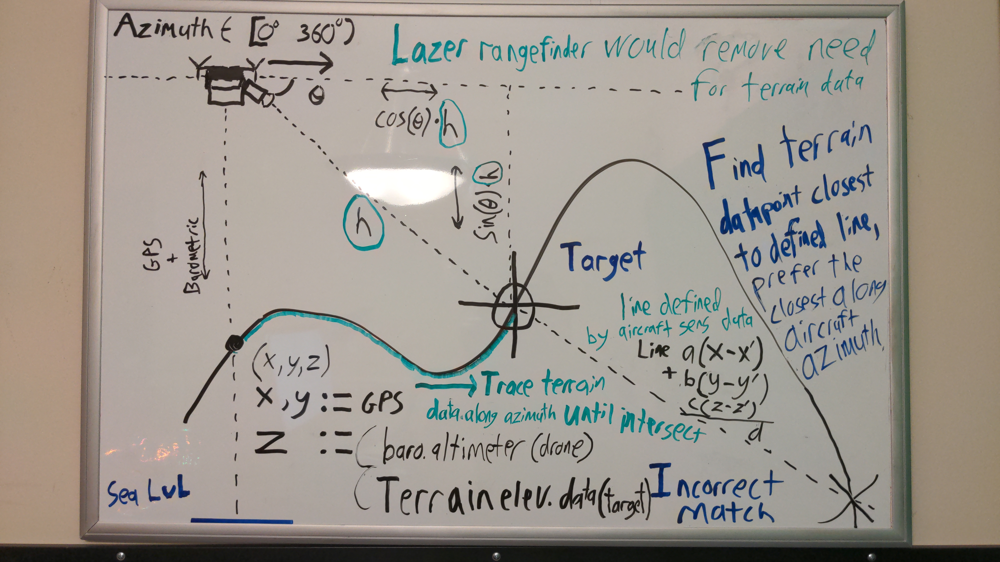

# Limitations of Indirect Fire in existing combined arms doctrine
While the importance of indirect fire (e.g. mortars, artillery, rockets) is well known to military historians, present-day soldiers, and others studied in methods of warfare, it remains an imprecise, blunt, and destructive tool relegated merely to a support role in current combined arms doctrine.

Mastery of combined arms through maneuver warfare and air superiority remain the determinate factors of supremacy in current doctrine, preventing the effective application of indirect fire. This is in large part due to the lack of precision and immediacy that are critical for its usage against a highly-mobile adversary.

As former U.S. Army Chief of Staff Gen. Mark A. Milley wrote in the forward to U.S. Army Training and Doctrine Command Pamphlet 525-3-1, [The U.S. Army in Multi-Domain Operations 2028](https://adminpubs.tradoc.army.mil/pamphlets/TP525-3-1.pdf): “emerging technologies” are “driving a fundamental change in the character of war.” They have “the potential to revolutionize battlefields unlike anything since the integration of machine guns, tanks, and aviation which began the era of combined arms warfare.”

# A new introduction to combined arms doctrine

Retired French army general and theory-crafter Guy Hubin writes in [_Perspectives tactiques_](https://warontherocks.com/2021/02/kill-the-homothetic-army-gen-guy-hubins-vision-of-the-future-battlefield/) that the possibility of precision indirect fires is one such fundamental change in the character of war driven by emerging technologies.

With recent advancements in consumer technology and publicly-available terrain datasets, the possibility arises of using inexpensive, low-altitude, un-manned fixed or rotary-wing aircraft to augment the capability of indirect fire. They can achieve this by improving indirect fire's accuracy in usage and providing precise, immediate information on targets to operators of a broad range of existing indirect fire weaponry.

# An upset in combined arms doctrine

This project portends the possibility of one such upset to existing combined arms doctrine. Low cost remote-controlled consumer-grade aircraft are the instrument of such a change in the character of warfare. Such aircraft are easy to operate by infantry units and inexpensive to replace. Meanwhile, when used to guide indirect fire, such aircraft may provide an effective counter to concentrated infantry and armored units of an adversary accustomed to fighting under current combined arms doctrine.

Due to the low altitude operation and inexpensive nature of such aircraft, they can counter concentrated combined arms forces even when higher-altitude air supremacy is not held or may not be achieved against an adversary. In such a fashion, low altitude consumer-grade aircraft upset the role of high-altitude military aircraft as the only effective foil to ground-based combined arms. High-altitude air supremacy becomes less important, especially in situations where the adversary is unable to field enough military aircraft to enforce an airborne presence or provide close air support.

Additionally, the combination of existing combined arms with new precision indirect fire capabilities may allow a unit to move more rapidly and gain ground at frightening speeds using classic fire-and-movement tactics. The advantage provided by precision indirect fire is that it can supress a target from beyond line of sight, reducing the burden of infantry units to supress a target while a friendly unit is in motion. Well executed maneuvers under such conditions may outpace a conventional force's ability to react, resupply, and reposition its own defenses.

# Adapting to an upset

Low altitude air supremacy must be considered equally as essential as that of high altitude in existing combined arms doctrine.

Infantry and mechanized units must guard against artillery-observing aircraft. Specialized low-altitude anti-air or electronic countermeasures (ECM) must be developed. Such platforms should be able to deter such aircraft just as easily as they can be deployed

Effort should be made into producing inexpensive 'bird of prey' aircraft that can enforce low-altitude air supremacy and deny an adversary's aerial artillery observation

# Premise



Multi-copter rotary-wing aircraft (e.g. quadroters, drones, etc.) typically have an onboard 3D A-GPS sensor for position/alt., a magnetometer for compass heading/azimuth,  and a sensitive barometer (atmospheric pressure sensor) for accurate absolute altitude relative to sea level.

They also typically have an "accelerometer" which allows it to stay level with the ground while in flight, and a camera.

Ideally for this purpose, the camera would point at horizon level during normal operation, and could be aimed at an angle <= 90 deg downward from the horizon at a target (while giving a very specific measure of its angle of declanation).

Given that the lat/long and altitude of the rotary-wing aircraft is known, its azimuth is known, and it is possible to obtain accurate worldwide elevation data (within ~30m) from [this api](https://pypi.org/project/elevation/), it should be a very simple math problem to calculate the position and altitude of the object aimed at by the camera.

If an invisible, imaginary mathematical line was "paramaterized" from the aircraft's camera towards the ground at its angle of declanation, the point closest along this line to the aircraft yet reasonably near any geographic lat/long/alt data point is likely to be the target which the camera is aiming at. This would provide the aircraft operator with a rough latitude, longitude, and elevation of the target to which the camera is aiming in an extremely short period of time.

While untested, such a rapid positional resolution may prove ideal for use by precision indirect fire teams


# Current status
run python geotiff_play.py (while in the playground directory) for a demonstration of geotiff parsing and a render of the City of Rome in Italy and its outlying terrain. Chart labels represent longitude and latitude (counterintuitively, the x and y axis are backwards in the standard description of a position via [latitude , longitude])


Using decimal lat/long, because no one has time for parsing degrees, minutes, seconds format.

```
user@mypc:~/projects/OpenAerialForwardArtilleryObservation/playground$
python geotiff_play.py
```


# Military Uses
Especially when employed with smart munitions (artillery, aerial, etc.) this would greatly aid the safety and processes of the [forward artillery observer](https://en.wikipedia.org/wiki/Artillery_observer) using soley inexpensive consumer electronics, all while reducing the risk of operator error (mismeasurement, miscalculation, etc.) and subsequent risk of friendly-fire incidents and risk to civilian lives.

In addition, a passive optical-based approach to target identification does not trigger the active protection system(s) of targets, including armored vehicles. This can be highly beneficial depending on the usage environment.

# Civilian Uses

This technology can be used for search and rescue operations, wildfire detection and management, measuring and surveying for civic engineering, and many other commercial purposes.

# US Arms export control notice
This software falls under the [Dual Use Technology](https://en.wikipedia.org/wiki/Dual-use_technology#United_States) category under applicable U.S. arms export control laws. If you are using this software in a country that is under restriction from the United States under the Arms Export Control Act, you may only use this for civilian purposes and may not use this software in conflict. This author is not responsible for unauthorized usage of this open source project
