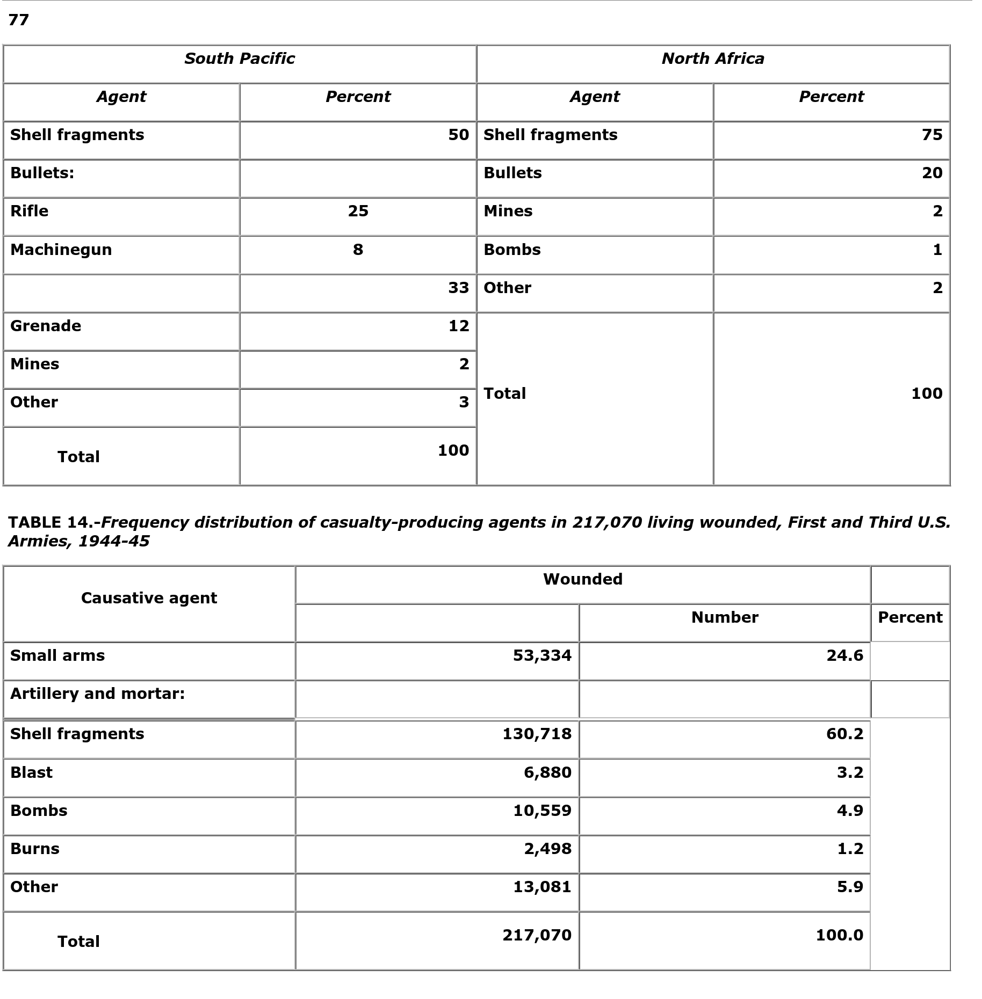

via [Wound Ballistics, Medical Department, United States Army (1962)](https://web.archive.org/web/20210317070618/https://history.amedd.army.mil/booksdocs/wwii/woundblstcs/)

Chapter 1 Item 76:

In order to determine which type of enemy weapon was most effective against U.S. troops in World War II, it would be necessary to know the causative agent for each wound inflicted. Not only was such information impossible to get for all areas for the entire war period but what was available was often inaccurate. Casualties who survived were frequently not able to determine the weapons that had wounded them. For those killed outright or who died of wounds, no opinion was available if there had been no witnesses. Prompt interment of bodies seldom left time for recovery of the missile that killed. Casualty surveys which supplied this type of information were made only in certain areas at specified times. However, these studies used different methods of reporting, and the lack of a uniform system made assessment and comparison of reports difficult.

Nevertheless, many interesting facts can be brought out from the material available. A report on the causative agents of battle casualties in World War II showed the comparative incidence of casualties from different types of weapons for several theaters. Compilers of the report believed that, while the more detailed subdivisions within their three major classes were open to question, their findings on the percent of total casualties due to small arms, artillery and mortars, and “miscellaneous” were reasonably accurate. From these they drew the following conclusions:

1. Small arms fire accounted for between 14 and 31 percent of the total casualties, depending upon the theater of action: The Mediterranean theater, 14.0 percent; the European theater, 23.4 percent; and the Pacific theaters, 30.7 percent.

2. **Artillery and mortar fire together accounted for 65 percent of the total casualties in the European and Mediterranean theaters**, 64.0 and 69.1, respectively. In the Pacific, they accounted for 47.0 percent.

The report showed the relative effectiveness of causative agents, which inflicted casualties on 217,070 living wounded of the First and Third U.S. Armies, European Theater of Operations, 1944-45 (table 14).

It is also interesting to note from two tables taken from studies conducted on Bougainville and in Italy that more casualties in the South Pacific were caused by rifle or machinegun fire than in the North African theater:

Table 14:

