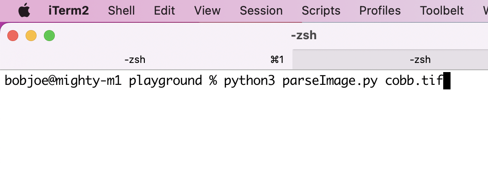
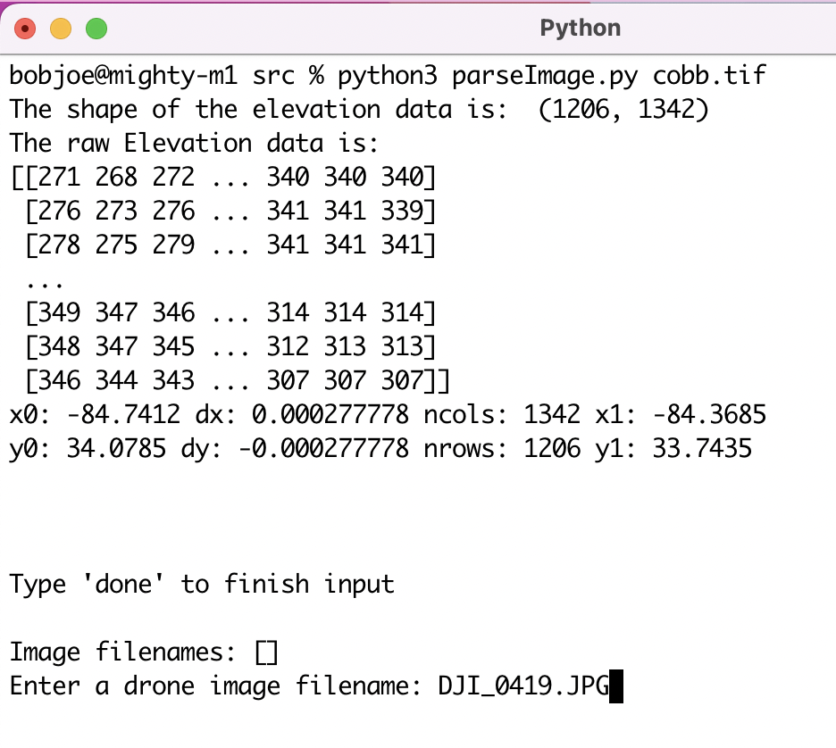
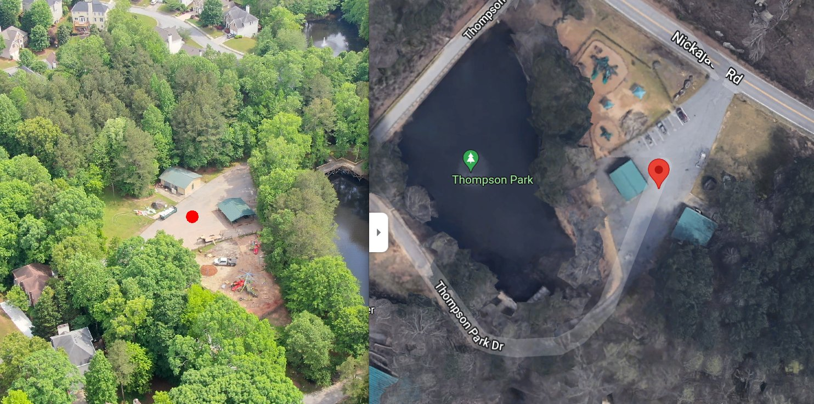

# Getting sensor data

The consumer models of some drones do not display their position, altitude, camera heading, and camera declanation during flight, but do store this data in the [EXIF](https://en.wikipedia.org/wiki/Exif) and [XMP](https://en.wikipedia.org/wiki/Extensible_Metadata_Platform) metadata of their still image captures

It is _**strongly suggested**_ that the user should calibrate the drone's magnetometer (compass) before each flight. The image metadata from an un-calibrated drone can be a few degrees off from the correct heading. This can result in dramatic Target-resolution inaccuracies. _**Always**_ verify a target match location from OpenAthena before use

E.x.:


### parseImage.py

[parseImage.py](./src/parseImage.py) has an experimental feature for automatic extraction and use of EXIF/XMP sensor information from drone photos

parseImage.py can be run in an **interactive** mode, or **headless** mode based on how many arguments are given after `python parseImage.py`. **Interactive** is designed for use by humans with one or more images, **headless** is designed for use by automation with one or more images. The output of **headless** mode is subject to change in future versions

#### interactive

Before using parseImage.py, make sure you have a valid geoTiff file that covers at least the location of the drone and the possible location of its subject. One way to do this is to get the drone's location from an [image's metadata](drone_sensor_data_blurb.md#manual-extraction), then [clip a geoTiff file of the surrounding area](./EIO_fetch_geotiff_example.md)

Next, choose an image for which to resolve the location of its subject. For example `DJI_0419.JPG`:


Finally, run `parseImage.py`. To save time, the geoTiff file can be provided as the first argument after `python parseImage.py` (or `python3 parseImage.py` on Macs for example):
```bash
python parseImage.py cobb.tif
```
(Note: the file must end in `.tif`. If you do not provide a geoTiff file, you will be prompted for input of a filename)



**RETURN**



Enter the full file path of the drone image if it is not in the `src` directory. Otherwise, just input the image filename and press **RETURN**

Multiple images can be processed at once in **interactive** mode. When you're finished inputing images, type **`done`** to begin processing


Let's copy that `NATO MGRS` into Google Maps:




Pretty good!

(note: the NATO 10-digit grid without GZD is underlined for easy reference. We need to include the full MGRS with GZD to give the precise location. An alternate, Warsaw pact style SK42 Gauss-Krüger grid ref is similarly underlined)

#### headless

If `parseImage.py` is given any additional arguments after a geoTiff file, it will be run in **headless** mode. It will try to read each argument (past the geoTiff file) as an image filename. It will try to resolve a target and put a resolved location in a file IMAGENAME.JPG.ATHENA for each image.

Image parsing can fail for any image for a variety of reasons, including the search running out of bounds, location not covered by the geoTiff, etc. However, an IMAGENAME.JPG.ATHENA file will only be generated where both the image metadata extraction and the terrain search process were sucessful

In a future version, these files of extention `.ATHENA` will be replaced by `.gpx` and be of the [GPS Exchange Format](https://en.wikipedia.org/wiki/GPS_Exchange_Format)

A Docker image for `parseImage.py` is available [**here**](https://hub.docker.com/repository/docker/t3l3tubie/openathena/general)

The openathena Docker image is convenient because it comes with all pre-requisites and openathena in a ready-to-go container that can be run on demand

For running with your own GeoTIFF DEM and drone images, mount a directory on your host system your desired files to a directory inside the `/home/user` in the container. Then pass as arguments a GeoTIFF file and one or more drone images using relative file paths like `./recon-photos/Altis.tif` and `./recon-photos/DJI_0666.JPG`

It is _**highly recommended**_ to choose a particular tag from the [releases page](https://github.com/mkrupczak3/OpenAthena/releases) rather than using the `latest` tag whenever openathena is to be used in a automated production environment

E.g (with [Docker already installed](https://docs.docker.com/engine/install/)):
```bash
docker pull t3l3tubie/openathena:v0.1.26-pre-alpha
docker run -v ~/Desktop/recon-photos/:/home/user/recon-photos openathena:v0.1.26-pre-alpha ./recon-photos/Altis.tif ./recon-photos/DJI_0666.JPG
```

The container will run and perform its task, then exit. A file like `~/Desktop/recon-photos/DJI_0666.JPG.ATHENA` will be available on the host filesystem, containing the data of the target calculated by OpenAthena


### manual extraction

One tool to view EXIF and XMP metadata on Mac, Linux, and Windows is Phil Harvey's (not affiliated with this project) [exiftool](https://exiftool.org/)

An equivalent command line tool available on Mac and Linux is [exiv2](https://exiv2.org/) (also not affiliated)


The following is an example of a command to show the sensor metadata of an image taken from a particular DJI drone:
```bash
exiv2 -P kt DJI_1234.JPG | grep -i "gimbal\|latitude\|longitude\|alt"
```


`drone-dji.GimbalYawDegree` is the direction of the aircraft's camera, from -180 (exclusive) to +180 (inclusive). 0 degrees is North, 90 is East, -90 is West, etc. Internally this number is converted to an `azimuth` for use by OpenAthena


`drone-dji.GimbalPitchDegree` is the amount of pitch of the camera's gimbal. While the DJI displays this number as negative, Internally the absolute value of this number `theta` is used for OpenAthena. Values of below -90 (straight down) produce undefined behavior and are prohibitted from being entered during manual data input