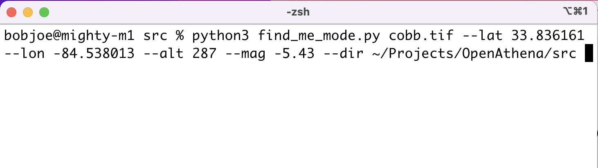
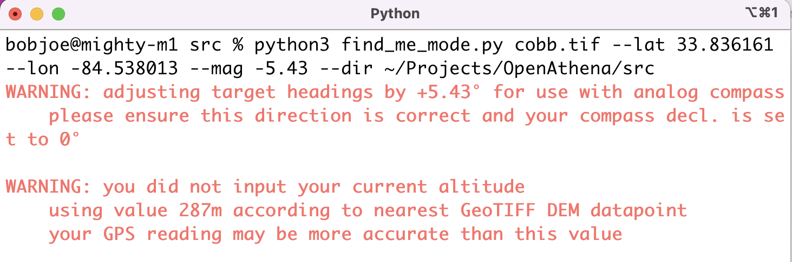

# Find Me Mode:

## Summary:

[`find_me_mode.py`](./src/find_me_mode.py) provides an alternate targeting mode where target match locations are provided in relative terms (bearing, distance, elevation change) from a fixed point for use by on the ground search and rescue teams, short-distance indirect fire teams (e.g. [mortars](https://en.wikipedia.org/wiki/Mortar_(weapon))) and the like

A single fixed location  may be specified either using a conventional WGS84 Latitude/Longitude pair or a NATO MGRS (with altitude optional).

If desired, [Magnetic Declination](https://ngdc.noaa.gov/geomag/declination.shtml) can be optionally specified (using the `--mag` flag) so that the target bearing will be output in magnetic heading (instead of true heading), e.g. for use with a handheld analog compass. This is not necessary for most digital compasses (e.g. a smartphone)

This mode is only intended for short range distances, otherwise will be inaccurate (curvature of the earth, etc.)

## Usage:
The drone photo `DJI_0419.JPG` and the [GeoTIFF Digital Elevation Model](https://github.com/mkrupczak3/OpenAthena/blob/main/EIO_fetch_geotiff_example.md) `cobb.tif` come included in the `./src` directory of this software for demonstration

### Mandatory arguments:
[`find_me_mode.py`](./src/find_me_mode.py) _must_ be provided a GeoTIFF DEM (ending in `.tif`) and a fixed location (using the flags `--lat` and `--lon`, or alternatively `--mgrs`) for successful operation

### Optional arguments:
The user may optionally provide a magnetic declination, altitude from sea level, and/or a directory on their filesystem to scan using `--mag`, `--alt`, and `--dir` respectively.

`--mag` represents magnetic declination as the necessary [adjustment on a magnetic compass heading](https://ngdc.noaa.gov/geomag/declination.shtml) to obtain a true heading. If this value _is not_ provided, find_me_mode will output any elative targets according to its true heading. Alternatively: if a value _is_ provided by the user, this will be used to convert each calculated true heading to a magnetic heading (e.g. for use with a handheld analog compass). Because [this adjustment](https://ngdc.noaa.gov/geomag/faqgeom.shtml#How_do_I_correct_my_compass_bearing_to_true_bearing) is done to convert (true heading) → (magnetic heading) instead of (magnetic heading) → (true heading), the sign of the adjustment is the opposite of that provided by the user in the `--mag` flag. The user should **exercise great caution and verify** that the sign of this adjustment is as intended to avoid undefined software behavior

`--alt` represents the altitude from sea level in meters (WGS84) of the user's fixed location to use for providing the relative coordinates of targets. This may be obtained easily from a handheld GPS, including a smartphone. If this value is not provided, find_me_mode will use the terrain altitude of the nearest datapoint from the provided GeoTIFF Digital Elevation Model (.tif). It is highly recommended that the user provides their GPS altitude here as it will be more accurate (especially if the user's altitude differs significantly from ground-level, such as on the roof of a tall building)

`--dir` represents the directory (folder) on the user's filesystem to scan for drone images. find_me_mode will scan all images in this directory, then it will provide the newest image available (according to the EXIF `DateTime` tag) as a target with relative coordinates. find_me_mode will re-scan the directory and repeat this process after each target is prosecuted until no more targets remain. If this value _is not_ provided, find_me_mode will attempt to use the current working directory of the user's session on their respective operating system. Alternatively: if this value _is_ provided, find_me_mode will use this directory to scan for drone images.

## Operation:
find_me_mode will provide a distinct user warning if the `--mag` flag **is** used and/or the `--alt` flag **is not** used:

A few seconds later, the following output will appear on the terminal interface:

### output information

`Target🎯` displays the filename of the drone image currently provided as a target

`Date/Time🕰️` displays the value of the EXIF `DateTime` flag of the target's image (usually in local time)

`NATO MGRS🗺️ ` displays the target's [NATO Military Grid Reference System (MGRS)](https://en.wikipedia.org/wiki/Military_Grid_Reference_System) coordinates, `Alt: ` displays its altitude

`Bearing` displays the true heading from the user towards the target (in degrees)

`Magnetic Bearing 🧭` if the `--mag` flag is used, this will appear in place of `Bearing:`. This displays the magnetic heading from the user towards the target (in degrees)

`Range 🏹 ` displays the horizontal range (in meters) from the user towards the target (e.g. for use in ballistic calculation). May be inaccurate over very-long distances where the curvature of the earth must be taken into account

`𝚫 Elevation⛰️ ` displays the vertical change (in meters) in elevation from the user towards the target

### windage adjustment

Windage adjustments can be applied to the target location to compensate for windage or other factors. Windage adjustment can be applied in increments of 4 meters (about one car's length) north, east, south, or west using each respective arrow key on the keyboard.

Windage adjustments do not affect the calculated altitude of a target.

`Nadjust` represents the adjustment of the target location (in meters) north or south to compensate for windage or other factors.

`Eadjust` represents the adjustment of the target location (in meters) east or west to compensate for windage or other factors.

### prosecuting multiple targets

find_me_mode will find the newest available image to use as a target after each target is prosecuted. The user may press the SPACEBAR (' ') key to mark the current target as prosecuted and switch to the newest available target. By default, windage adjustments will persist to the display of the next target. The RETURN key ('↩') may be used to reset `Nadjust` and `Eadjust` windage adjustments to 0m each.

### view current target

find_me_mode allows the user to view the image of the current target. The user may press the o ('o') key to open a temporary copy of the target's image. The resulting image view window may be closed by the user at the time of their choosing

### adjust fixed location

find_me_mode allows the fixed reference location to be updated during software operation if the user has moved to a new location. The user may press the BACKSPACE ('🔙', '←', or 'delete') key to initiate input for a new location. Next, the user may provide a NATO MGRS, or immediately press the RETURN key ('↩') to input a latitude and longitude pair. The user may next provide the altitude of their new location, or immediately press the RETURN key ('↩') to automatically use the terrain Altitude value of their new lat/lon

### Autel sensor data warning
Numerous in-accuracies have been observed in the sensor metadata of images taken by drones made by Autel Robotics. In many cases, this may result in in-accurate target resolutions. To inform the user of possible incorrect target resolutions, a prominent warning will appear in the output if the image filename contains `MAX`, as is the case by default for images taken by the Autel Evo II. At present only the filename is used to make this check and not the EXIF Make tag value

# Background:

[`parseImage.py`](./drone_sensor_data_blurb.md) allows for the extraction and use of metadata from drone images to pinpoint a precise location to which a drone's camera is aiming at (in the exact center of the image frame)

paresImage.py may provide the absolute location of each target resolution as a Lat/Lon pair with altitude, a NATO MGRS with altitude, or a SK42 Geodetic or Gauss-Krüger value with SK42 altitude. While such target resolutions may prove ideal for use by long range artillery systems with digital fire control systems, target locations in absolute terms are difficult to use by small indirect fire teams (e.g. mortars) or search and rescue teams on the ground.

find_me_mode.py was created with the intention to provide more timely, relevant information to an operator of OpenAthena. find_me_mode allows an operator to continuously prosecute the newest available target, even while new target images are being added in real time. Each target's location is provided in relative terms (Bearing, Range, 𝚫elevation) to facilitate more immediate use
